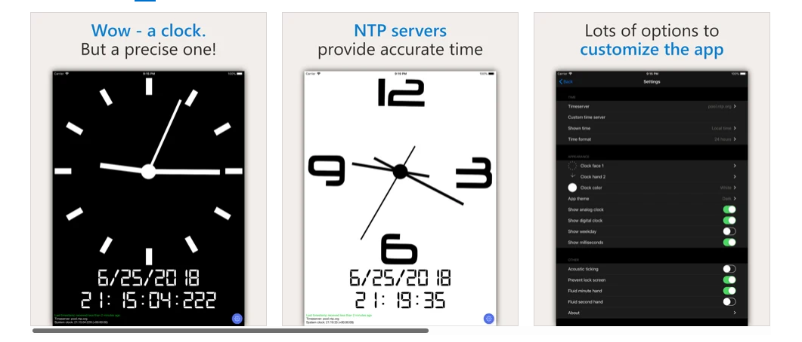

# NTP-server 

Create a server (and demo client) using Go and gRPC that responds to time requests and fetches the time via SNTP or NTP on time.apple.com and time.microsoft.com.
The client can pass which NTP server it would like to query, and the response will be a time stamp to be properly printed to the console.

## Introduction 

Every device in the network will have an internal clock. These internal clocks will track both the time and the date

Network Time Protocol (NTP) is a protocol used to synchronize computer clock times in a network. It belongs to and is one of the oldest parts of the TCP/IP protocol suite. The term NTP applies to both the protocol and the client-server programs that run on computers. 

To automate our tasks we will make use if TaskFile